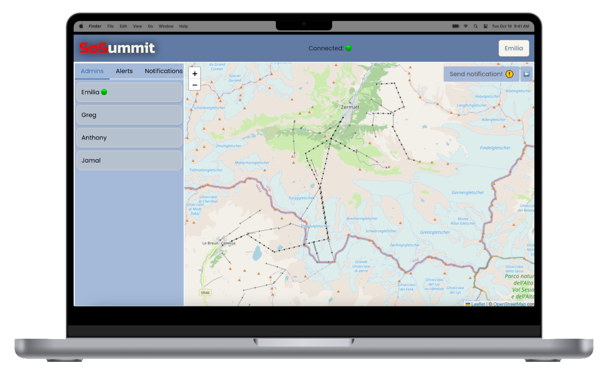

<h1 style="font-family: RussoOne-Regular"><span style="color: red">SoS</span>ummit</h1>

## Contributors
Gerard Sole Clua, Pooya Jafariberenji, Loïc Khodarkovsky, Giovanni Silvotti

## Overview
This is a safety application designed for ski resorts, allowing ski patrol members to receive alerts from skiers in distress and by providing a dashboard where they can see the live location of their colleagues to facilitate the coordination of the rescue. The dashboard can also send notifications to all users regarding inclement weather or other relevant information.

Resort visitors can connect to the resort to subscribe to notifications, and, should the need arise, send a help request to the dashboard. Ski patrollers can also view help requests on a map on their mobile device.

## Tech Stack
- Typescipt
### Backend:
- Express.js
- MongoDB (Mongoose)
- Socket.IO for real-time communication
### Frontend (Dashboard):
- React (Vite)
### Mobile App:
- React Native (Expo)
### Deployment:
- Backend: Render
- Frontend (Dashboard): Netlify
- Database: MongoDB Atlas
- Native: Expo

## Features
- **Live Location Tracking:** Ski patrol members can see the live location of their colleagues on the dashboard.
- **Alert System:** Skiers can send help requests to the ski patrol, which are displayed on a map for ski patrol to respond to.
- **Push Notifications:** Both ski patrol and resort visitors receive notifications from the dashboard.

Coming Soon:
- **Fall detection**.

## Screenshots
<div style="display: flex;">
  
  
  
</div>

## Getting Started
Clone the repository.

Run ```npm install``` in the server, client-dashboard, and client-mobile app directories.

Set up the MongoDB database and configure the connection in the server's environment variables following the provided ENV template.

Start the server by running ```npm run dev```.

Start ngrok on the port that the server is running on using ```ngrok http PORT``` and paste the returned URL into the environment variables of the mobile app.

Run the dashboard using ``` npm run dev```.

Start the mobile app using ```npx expo start --tunnel```.

<h3 style="color: firebrick"> Happy skiing! ⛷️</h3>